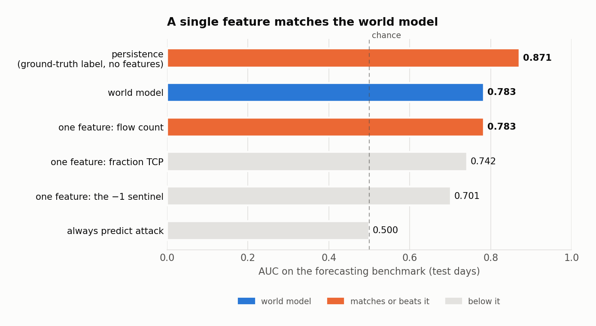
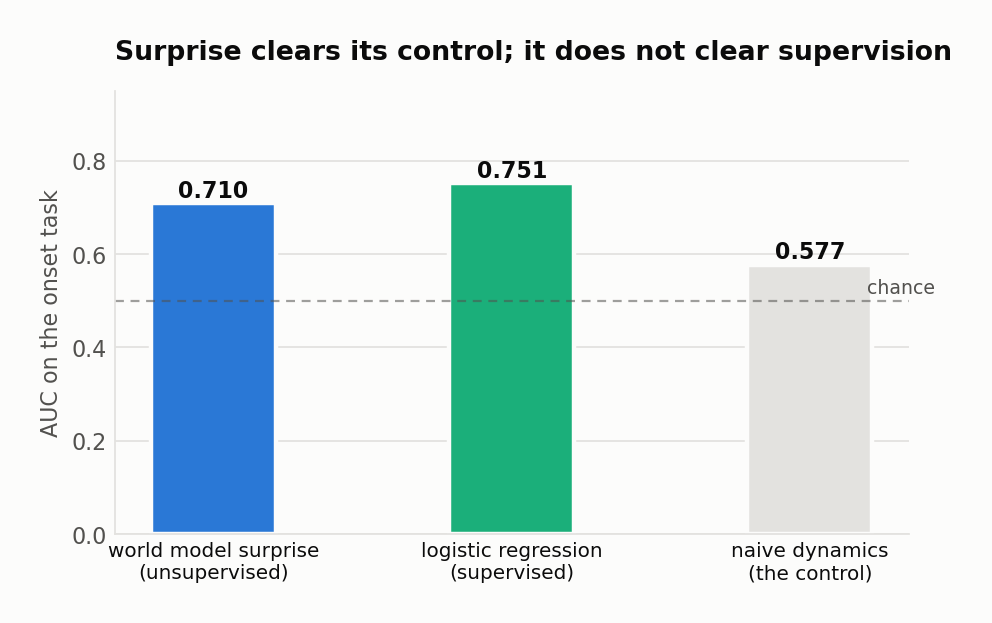
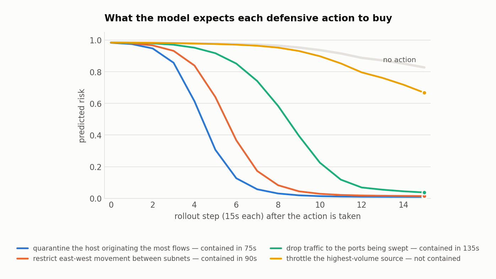

# Foresight

**A world model for network attack forecasting.** Learns the transition dynamics
`P(S_t+1 | S_t)` of a network from traffic telemetry, rolls the learned dynamics
forward K steps, and reports the probability that the current trajectory
converges on an infiltration — before the kill chain completes.

[](https://www.sih.gov.in/sih2026PS)
[](https://www.sih.gov.in/sih2026PS)
[](#)
[](#)
[](tests/test_foresight.py)
[](#)

---

## The problem statement

> **SIH26153 — AI based Network Attack Forecasting from Network Traffic Data**
> National Technical Research Organisation (NTRO) · Blockchain & Cybersecurity

> "Design and develop a software prototype that learns the evolving state of a
> computer network from traffic telemetry and predicts the likelihood and
> progression of malicious activity **before compromise is completed**."

The statement makes one distinction three separate times, so it is the whole
design:

> "The core deliverable is a learned model of network state transition dynamics
> — **not a static classifier**."

A conventional intrusion detector maps each flow to benign or malicious in
isolation. That discards the structure that actually identifies an infiltration:
the order in which ports are probed, SYN flags preceding ACK floods, the
inter-arrival timing of reconnaissance before lateral movement begins. An
infiltration is a process unfolding over time, not one anomalous packet.

Foresight instead learns how network state *evolves*. Given the observed state
at time `t` — active flows, flag distributions, port activity, packet timing —
it models the distribution over the next state. That makes forward simulation
possible: roll out K steps and ask whether this trajectory is heading somewhere
bad, while there is still time to act.

## Mandatory scope

Every requirement the statement names, what was built, and where the evidence is.

| requirement | status | evidence |
|---|---|---|
| Flow-level features (NetFlow/IPFIX) | done | 35 features, 60s windows at a 15s stride — [`data/flows.py`](foresight/data/flows.py) |
| Packet-level features (PCAP-derived) | extracted, deliberately unused | TTL variance, TCP window, fragment flags, retransmissions — [`data/packets.py`](foresight/data/packets.py); [left out for a measured reason](docs/RESULTS.md#packet-level-features-extracted-measured-and-left-out) |
| World model learning `P(S_t+1 \| S_t)` | done | LSTM + attention dynamics head — [`model/world.py`](foresight/model/world.py) |
| K-step forward simulation | done | 6-step rollout, supervised on its own trajectory |
| Generalise to unseen attack patterns | done | day-based split; every test family is unseen in training |
| MITRE ATT&CK stage mapping | done | 0.527 over five stages against a 0.200 chance floor — [`predict/stages.py`](foresight/predict/stages.py) |
| Explainability (attention / SHAP) | done | gradient×input + attention + per-stage weights — [`predict/engine.py`](foresight/predict/engine.py) |
| Offline demo interface | done | CLI and a local web UI, no network calls — [`web/`](web/index.html) |
| Benchmark vs logistic regression | done | beats both baselines — and [we report what else beats it](docs/ANALYSIS.md) |

Explainability is not optional in the statement — *"black-box outputs without
interpretability are not acceptable."* Every prediction carries the features that
drove it, the attention over the observed history, and the measured reliability
of the stage it names.

## Results

Held-out capture days, carrying attack families never seen in training.

| model | F1 | precision | recall | FPR | AUC |
|---|---|---|---|---|---|
| **world model** | **0.557** | 0.387 | 0.992 | 0.545 | **0.783** |
| logistic regression, current window | 0.553 | 0.384 | 0.984 | 0.548 | 0.761 |
| logistic regression, full history | 0.540 | 0.412 | 0.784 | 0.388 | 0.716 |

The world model wins the benchmark the statement asks for. **That table is not
the headline, and this is the part most submissions will not tell you:**

<picture>
  <source media="(prefers-color-scheme: dark)" srcset="docs/figures/shortcuts-dark.png">
  
</picture>

A single feature — flow count — scores 0.783, matching the model exactly. A
persistence baseline that repeats the last observed label and uses no features at
all scores 0.871. Attack episodes in this capture run for minutes against a
90-second horizon, so the benchmark is graded largely on autocorrelation rather
than on foresight.

[**docs/ANALYSIS.md**](docs/ANALYSIS.md) works out what the benchmark was really
measuring, what survives that scrutiny, and what to change. It is the most
important document in this repository.

### What does survive

Train the dynamics on benign traffic only — no attack label anywhere in the
objective — and score each window by how badly the model predicted it. Against
the control that matters, which is to predict no change and score the movement:

<picture>
  <source media="(prefers-color-scheme: dark)" srcset="docs/figures/surprise-dark.png">
  
</picture>

0.710 against 0.577 on the onset task, and 0.752 against 0.551 across all
windows. The model learned something real about how traffic evolves rather than
merely that traffic moved — and it did so without ever seeing an attack label,
which is a stronger generalisation claim than any supervised number here.

### Beyond the statement: counterfactual defence

Nothing in the statement asks for this, and only a model that predicts *states*
rather than labels can answer it. Edit the state as a defensive action would,
roll forward under that constraint, and read how fast the incident is contained.

<picture>
  <source media="(prefers-color-scheme: dark)" srcset="docs/figures/interventions-dark.png">
  
</picture>

The ordering is what the actions mean: quarantine removes the host, throttling
only slows it. The model has never observed a network under intervention, so
each rollout also reports how far the edit moved the state from anything it has
actually seen.

### Three results reported as negative

- **Packet features do not help.** They appear to add 0.016 AUC, but coverage in
  the published dataset correlates with attack family, and coverage *alone*
  scores 0.718. Held at constant coverage the gain vanishes, then reverses.
- **Host-graph features hurt.** Test AUC 0.761 without them, 0.606 with — they
  let the model fit the topology of the days it trained on. Behind a flag, off.
- **Lead time is at chance.** The warn rate at a 5% false-alarm budget is 39%
  against a 40% floor produced by the lookback window alone.

## Setup

Python 3.11+. No GPU required; training takes about six minutes on a CPU.

```bash
git clone https://github.com/cattolatte/foresight.git && cd foresight
python3 -m venv .venv && source .venv/bin/activate
pip install torch numpy pandas pyarrow fastapi uvicorn python-multipart matplotlib huggingface_hub fsspec
```

Fetch the flow table — 2.83M flows of CIC-IDS2017, about 1.1 GB:

```bash
mkdir -p data && python3 -c "import pandas as pd; pd.read_parquet('hf://datasets/rdpahalavan/CIC-IDS2017/Network-Flows/CICIDS-Flow.parquet').to_parquet('data/flows.parquet')"
```

Train the world model, then produce the benchmark and the stage classifier:

```bash
python3 foresight/model/train.py --epochs 60
python3 eval/benchmark.py
python3 eval/stages.py
```

Run the demo interface. It makes no network calls of any kind:

```bash
python3 -m uvicorn foresight.server:app --port 8090
```

Open `http://127.0.0.1:8090`, then drop in a flow CSV or parquet — or click one
of the capture days it finds on the machine. To drive it from a terminal:

```bash
python3 foresight/cli.py data/flows.parquet --day 2017-07-07 --top 8
```

The interface also runs with **no backend at all**: it falls back to analyses
exported by `scripts/export_static.sh`, so `web/` can be opened straight from a
file or served as static files on a machine with no Python environment.

## Reproducing every number

```bash
python3 -m pytest tests/          # 16 tests, one per failure mode that reached working code
python3 eval/benchmark.py         # the headline table
python3 eval/shortcuts.py         # what beats it without a model
python3 eval/surprise.py          # benign-trained, unsupervised
python3 eval/perhost.py           # the host as the unit of modelling
python3 eval/stages.py            # MITRE stage mapping, on both splits
python3 scripts/make_figures.py   # every figure, from the saved results
```

Figures are rendered from `eval/results/*.json` rather than typed in, so a chart
cannot drift away from the run that produced it.

## Repository layout

```
foresight/
  data/        flow windowing, host windowing, packet extraction, graph features
  model/       world model, dataset construction, training
  predict/     inference engine, stage classifier, counterfactual interventions
  baseline.py  logistic regression and metrics
eval/          benchmark, shortcuts, surprise, per-host, stages
web/           offline interface (+ precomputed analyses for static hosting)
docs/          RESULTS.md, ANALYSIS.md, figures
tests/         16 tests, each pinned to a bug that reached working code
```

## Documents

| document | what it is for |
|---|---|
| [docs/ARCHITECTURE.md](docs/ARCHITECTURE.md) | the two-page architecture document the statement asks for |
| [docs/RESULTS.md](docs/RESULTS.md) | every deliverable the statement asks for, with its measurement |
| [docs/ANALYSIS.md](docs/ANALYSIS.md) | the audit — what the benchmark was really measuring, and what to change |

### Submission checklist (SIH26153)

| deliverable | status |
|---|---|
| Source code | this repository |
| README with setup instructions | [above](#setup) |
| Architecture document (max 2 pages) | [docs/ARCHITECTURE.md](docs/ARCHITECTURE.md) |
| Demo video (max 2 minutes) | to record — the web interface is the demo |
| Technical presentation (max 5 slides) | to produce |

## Data

CIC-IDS2017, five capture days (3–7 July 2017), 2,827,677 flows. Train on
3–5 July (benign, FTP and SSH brute force, denial of service); test on 6–7 July
(web attacks, infiltration, port scan, botnet, DDoS) — families the model never
saw. The packet tables of the same corpus supply the packet-level features.
