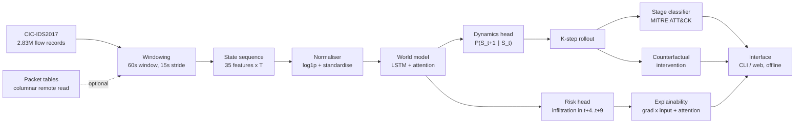

# Architecture

**Foresight — SIH26153, AI based Network Attack Forecasting from Network Traffic
Data (NTRO).** Two pages, as the statement asks.

## Design premise

The statement's core requirement is *"a learned model of network state
transition dynamics — not a static classifier."* Every architectural choice
below follows from taking that literally: the unit of modelling is a **network
state over a time window**, not a flow, and the model's primary output is the
**next state**, not a label. The risk score is a head *on top of* the dynamics,
so the system can be asked questions a classifier cannot — including what
happens if a defender intervenes.

## Pipeline



## 1. Feature extraction

**Flow level** (`foresight/data/flows.py`). Flows are aggregated into 60-second
windows stepped every 15 seconds, producing 35 features per window: the six TCP
flag counters the statement names, nine inter-arrival and duration statistics,
twelve volume and packet-size statistics, plus derived cardinality features
(distinct destination ports and IPs, port entropy, fan-out).

Sixty seconds is imposed by the data, not chosen: attack rows carry
minute-resolution timestamps, so at 30s two thirds of windows are empty by
construction and the model learns the clock. The 15s stride recovers sequence
count — three days at one window a minute is only ~2,000 sequences for a
300k-parameter model.

**Packet level** (`foresight/data/packets.py`). TTL variance, TCP window size,
IP fragment flags, payload distribution and retransmission counts, decoded from
the packet tables. Those tables are 272 GB; because Parquet is columnar, the ten
required columns are fetched by range request — 0.4 GB rather than 272. Built,
validated, and **deliberately excluded** from the shipped model: coverage
correlates with attack family and coverage alone scores 0.718 AUC, so the
apparent gain is the dataset's release process rather than the packets. See
[RESULTS.md §6](RESULTS.md).

**Host level** (`foresight/data/hosts.py`). The same windowing applied per
internal host. Not the default, but the basis of the strongest finding in the
project — see [ANALYSIS.md §6–7](ANALYSIS.md).

## 2. World model

`foresight/model/world.py`, ~300k parameters.

| stage | shape | purpose |
|---|---|---|
| input projection | 35 → 128 | lift the state into the latent space |
| LSTM encoder, 2 layers | 12×128 | temporal context over the observed history |
| multi-head attention, 4 heads | 12×128 | which past windows matter, and the explanation channel |
| dynamics head | 128 → 35 | `P(S_t+1 \| S_t)` — the core deliverable |
| risk head | 128 → 1 | infiltration probability over the forecast span |

Training is multi-objective:

```
loss = huber(next_state) + 0.5 · rollout(4 steps) + 0.3 · BCE(risk)
```

The rollout term matters. Trained one step ahead and rolled out K, the model
oscillated between a near-empty state and a scan signature — faithful to the
data, but not a trajectory a defender could act on. Supervising the four-step
rollout trains the model on the distribution it is actually asked to produce.

## 3. Forecasting protocol

The model observes 12 windows and forecasts 6, with a **gap of 4 windows**
between them. The gap is not a hyperparameter: windows overlap, so without it
the label at `t+1` covers traffic the history already contains, and two of six
horizon steps become detection wearing a forecast's name.

Splits are by capture day — train 3–5 July, test 6–7 July — so every test attack
family is unseen, which is what *"generalise to unseen attack patterns"*
requires. Checkpoint selection uses a chronological split of the training days;
the test days are touched once.

## 4. Inference and explainability

`foresight/predict/engine.py`. A prediction carries four things, because the
statement rules out black-box output:

1. **Risk trajectory** — the rollout's per-step infiltration probability.
2. **Attack stage** — a multinomial logistic regression over the same named
   features (`predict/stages.py`), fitted on *rolled-forward* states because
   that is what it is shown at inference. Reported with the held-out precision
   of the class it names, so a confident label cannot pass for a reliable one.
3. **Driving features** — gradient×input attribution over the observed history.
4. **Attention** — which observed windows the encoder weighted.

## 5. Counterfactual intervention

`foresight/predict/counterfactual.py`. Beyond the statement, and only possible
because the model predicts states. Each playbook action is a physical scaling of
the features it would genuinely affect; the edit is applied to every state the
model predicts before it is fed back, so the trajectory is simulated *under the
constraint*. Reported as time-to-containment rather than peak reduction — acting
now cannot rewrite traffic that already happened.

## 6. Interface

`foresight/server.py` + `web/index.html`. FastAPI with a zero-dependency
single-file front end: risk timeline with ground-truth shading, horizon
forecast, driving features, stage with its caveat, and the intervention table.
No CDN, no telemetry, **no network calls of any kind**. A CLI
(`foresight/cli.py`) covers the terminal case, and the page falls back to
precomputed analyses when no backend is present, so it also runs as static
files.

## Reproducibility

Every figure is rendered from `eval/results/*.json` rather than typed in. 16
tests, each pinned to a specific bug that reached working code — timestamp
parsing, state/label alignment, AUC tie handling, playbook validation, split
leakage. `python3 -m pytest tests/`.

## Known limits

Stated here rather than discovered by a reviewer: the benchmark is matched by a
single feature and beaten by a persistence baseline; early warning is at chance;
the corpus supplies only ~14 attack episodes for onset learning; and the dataset
carries no exfiltration ground truth, so that stage is never predicted.
[ANALYSIS.md](ANALYSIS.md) is the full accounting.
