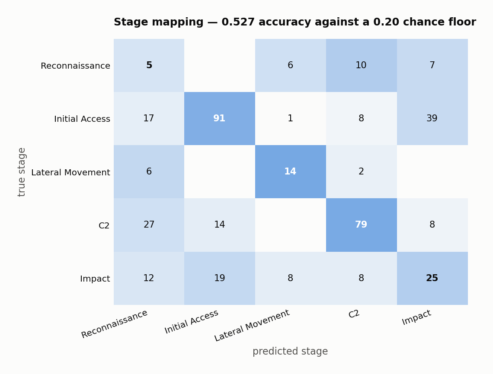

# Results

Every deliverable **SIH26153** asks for, with the measurement that supports it —
and, where the measurement does not support it, that said plainly instead.

All numbers are on capture days the model never trained on, carrying attack
families it never saw. Model selection used a chronological split of the
*training* days; the test days were touched once, to produce these tables.

> **Read [ANALYSIS.md](ANALYSIS.md) alongside this document.** It establishes
> that the headline benchmark is easier than it looks — a single feature matches
> the model, and a baseline with no features at all beats it. Everything here is
> reported inside that caveat rather than despite it.

**Method.** Flows are aggregated into 60-second windows stepped every 15
seconds. The model observes twelve windows and forecasts the next six. The
forecast label starts four windows past the last observed traffic, which is the
first window whose traffic the history has not already seen — without that gap,
overlapping windows make two of six horizon steps detection wearing a
forecast's name.

| | |
|---|---|
| **Train** | 3–5 July 2017 — benign, FTP/SSH brute force, denial of service |
| **Test** | 6–7 July 2017 — web attacks, infiltration, port scan, botnet, DDoS |
| **Features** | 35 flow-level, per window |
| **Windows** | 8,568 training sequences, 5,710 test |
| **Base rate** | 0.258 of test windows are followed by an attack |

---

## 1. The benchmark the statement requires

> "Benchmark results comparing model performance (F1 score, precision, recall,
> false positive rate) against a logistic regression baseline trained on the
> same features, demonstrating that the world model's temporal dynamics learning
> provides measurable improvement."

| model | F1 | precision | recall | FPR | AUC |
|---|---|---|---|---|---|
| **world model** | **0.557** | 0.387 | 0.992 | 0.545 | **0.783** |
| logistic regression, current window | 0.553 | 0.384 | 0.984 | 0.548 | 0.761 |
| logistic regression, full history | 0.540 | 0.412 | 0.784 | 0.388 | 0.716 |

The world model leads on both headline measures. The margin over the
current-window baseline is 0.004 F1 and 0.022 AUC, which is thin, and the
operating point deserves reading before the ranking: at a 0.5 threshold every
model here recalls almost everything and is wrong about three times in five
against a base rate of 0.258. AUC is the more meaningful comparison.

"Measurable improvement" is satisfied in the literal sense and is not worth
much, because of what else clears the same bar:

<picture>
  <source media="(prefers-color-scheme: dark)" srcset="figures/shortcuts-dark.png">
  
</picture>

A single feature — flow count — reaches 0.783, matching the model to three
decimal places. Persistence, which repeats the ground-truth label of the last
observed window and uses no features whatsoever, reaches 0.871. This benchmark
does not separate a world model from a threshold on traffic volume.
[ANALYSIS.md](ANALYSIS.md) explains why and proposes what replaces it.

## 2. Lead time, and why the obvious version of it is worthless

The statement's real claim is prediction *"before compromise is completed"*, and
F1 does not measure that. A detector that fires in the same window the attack
lands scores perfectly and warns nobody.

Lead time asks directly: when a model first crosses its threshold, how long
remains before the attack begins? The first version of this measurement gave
every model its F1-optimal threshold and duly reported that a baseline with a
false-positive rate of 0.99 had lead time identical to the world model. Of
course it did — it was alarming almost constantly.

Measured at a common 5% false-alarm budget, over 57 attack episodes:

| model | warn rate | chance floor | median lead |
|---|---|---|---|
| world model | 39% | 40% | 150s |
| logistic regression, current window | 44% | 40% | 150s |
| logistic regression, full history | 37% | 40% | 150s |

The chance column is the point. Searching ten windows back for a crossing gives
any model ten independent opportunities, so at a 5% false-alarm rate about 40%
of episodes are "warned" by arithmetic alone — `1 − (1 − 0.05)¹⁰`.

**Early warning is not demonstrated.** Every model sits at or below the floor.
Reported as a failure rather than dressed up as a 150-second median.

## 3. Attack-stage mapping (MITRE ATT&CK)

> "Predicted attack stage: mapping to MITRE ATT&CK phases — Reconnaissance,
> Initial Access, Lateral Movement, Command & Control, or Exfiltration — based
> on the predicted future state."

The first implementation was a rule cascade over port entropy, fan-out and SYN
counts. Measured against the data, its thresholds were fiction: median benign
`unique_dst_ports` is 19 against a branch firing above 8; `fanout` never exceeds
0.41 in any family against a branch needing 1.2; `SYN Flag Count` peaks at 0.13
against a branch needing 0.6. Two of five stages were reachable and every window
on both test days got the same answer. It read well and measured nothing.

It is now a multinomial logistic regression over the same named features — one
weight per feature per stage, so the evidence shown is what carried the decision.

<picture>
  <source media="(prefers-color-scheme: dark)" srcset="figures/stages-dark.png">
  
</picture>

Both numbers below are computed on states the model *predicted*, not on observed
windows. That distinction cost 23 points and was nearly missed: fitted on
observed windows and applied to rolled-forward ones — which is what the
interface actually shows a stage for — accuracy fell from 0.755 to 0.543 and
every stage collapsed onto Command & Control, because the rollout regresses
toward a mean the classifier read as that one class. Naming the stage of a
*future* state is harder than labelling the current one, and the honest number
is the harder one.

| split | accuracy | chance | what it measures |
|---|---|---|---|
| day split (train 3–5 July) | 0.073 | 0.200 | a structural limit, not the method |
| interleaved blocks, gap enforced | **0.527** | 0.200 | the operating characteristic |

The day split is degenerate *for this task*: the training days contain only
Initial Access and denial of service, so Reconnaissance, Lateral Movement and
Command & Control exist only in the test set. A classifier cannot name a class
it was never shown. Stage identification is not forecasting — it describes a
state the model has already predicted — so it is fairly scored on a split
containing every stage on both sides. Each attack here runs once, for a
scheduled stretch, so blocks are interleaved rather than cut chronologically,
and a four-window gap is discarded at every boundary because a 60s window every
15s shares three quarters of its traffic with its neighbour.

| stage | precision | recall | support |
|---|---|---|---|
| Reconnaissance | 0.075 | 0.179 | 28 |
| Initial Access | 0.734 | 0.583 | 156 |
| Lateral Movement | 0.483 | 0.636 | 22 |
| Command & Control | 0.738 | 0.617 | 128 |
| Impact (DoS) | 0.316 | 0.347 | 72 |

Reconnaissance is the weak class: 0.075 precision means most windows called
reconnaissance are not. Command & Control and Initial Access carry their weight.
The interface reports each stage with the held-out precision of the class it
just named — *"Lateral Movement is right 48% of the time; treat it as a hint,
not a finding"* — so a confident-looking label cannot be mistaken for a reliable
one.

The dataset carries **no exfiltration ground truth**, so that stage is never
fitted and never predicted. Denial of service maps to Impact, which is not among
the five stages the statement names, and is carried as its own class rather than
forced into one that does not fit.

## 4. Explainability

> "Black-box outputs without interpretability are not acceptable."

Three independent channels, all offline:

- **Feature attribution** — gradient×input over the observed history, naming
  which flags, ports and flow statistics pushed the risk up or down.
- **Attention** — which of the twelve observed windows the encoder weighted.
- **Stage evidence** — the per-feature contribution to the stage logit against
  the mean of the rival stages, so the answer is *why this stage and not another*.

Because the stage model is linear over named features, its explanation is the
decision rather than a post-hoc approximation of it.

## 5. Forward simulation and counterfactual defence

Not asked for by the statement. A classifier scores the traffic it is given; a
model of transition dynamics can be asked what happens if the state were
*different*.

<picture>
  <source media="(prefers-color-scheme: dark)" srcset="figures/interventions-dark.png">
  
</picture>

| action | risk at horizon | contains in |
|---|---|---|
| quarantine the top talker | 0.83 → 0.01 | 75s |
| restrict east-west movement | 0.83 → 0.01 | 90s |
| block the scanned ports | 0.83 → 0.04 | 135s |
| rate-limit the source | 0.83 → 0.67 | not within the horizon |

The first version reported every action as reducing peak risk by exactly 0.00.
Two causes, both silent. The playbook scaled features that no longer existed —
it was written against host-graph descriptors that later became optional and
default to off — so three scalings in five matched nothing, and the panel read
as "no defensive action helps" when none had been applied. And the metric was
the reduction in *peak* risk across the horizon, which could not have been
anything but zero: at the first rollout step only one row of the history carries
the intervention and the rest is observed attack traffic.

Acting now cannot rewrite traffic that already happened. The honest measure is
how fast the constrained trajectory comes down once that history flushes. The
ordering is what the actions mean: quarantine removes the host, throttling only
slows it.

Two limits, stated because a defender acting on this needs them. Each action is
a hand-specified physical approximation, not a learned one. And the model has
never observed a network under intervention, so every rollout reports how far
the edit moved the state from anything it has seen — all four stay inside the
range where the dynamics still have something to say.

## 6. Packet-level features: extracted, measured, and left out

> "Teams must work with both flow-level and packet-level features."

TTL variance, TCP window size, IP fragment flags, payload-size distribution and
retransmission counts. None survive into a flow record — by the time traffic is
a flow summary the header fields have been averaged away — so they had to come
from the packet tables.

Those tables are **272 GB across eighteen files**. Downloading a prefix does not
help: the files are ordered by capture time, so the first 7.7 GB covered only the
benign Monday and every attack day sat past the end of it. Parquet is columnar,
so the fix was to stop downloading files. Ten of roughly two hundred and fifty
columns carry everything named above, and a column chunk can be fetched by range
request on its own — **23 MB per file instead of 15 GB, 0.4 GB instead of 272.**

The fields decode correctly: TTL concentrates on the 64/128/255 OS defaults, TCP
flag bytes take canonical values, the DF bit is set on 72% of packets. Coverage
after extraction is 1,455,598 of 2,827,677 flows, 35–65% on every day.

They are not in the model, for a measured reason. Coverage is **not random with
respect to attack family**: 99.6% of PortScan flows have packet data against 0%
of the web attacks. That is a property of which files the dataset publishes, not
of the network. A logistic regression given the *coverage rate as its only
feature* reaches test AUC 0.718 — against 0.783 for the full world model.

So the apparent gain is checked against that:

| evaluation | flow features | flow + packet | delta |
|---|---|---|---|
| all windows, packet features mean-imputed | 0.778 | 0.794 | **+0.016** |
| windows with coverage ≥ 0.3 | 0.638 | 0.643 | +0.005 |
| windows with coverage ≥ 0.5 | 0.676 | 0.662 | **−0.014** |

Holding coverage roughly constant removes the gain and then reverses it. The
+0.016 is the release process, not the packets. The extractor ships and runs
behind `build_windows(..., packets=...)`; the headline model does not use it.

## 7. What the data cost, which is most of the time spent

**The timestamps are two formats in one column.** Benign rows read
`03/07/2017 08:55:58`, attack rows `4/7/2017 10:30` — day-first, no seconds.
Parsed with pandas defaults, four rows in five become `NaT` and *every* attack
row is among them: the dataset appears to span one day and every hour appears 0%
malicious. With `dayfirst=True, format="mixed"` it parses completely and the
canonical five-day structure appears. This nearly caused the dataset to be
discarded as unusable.

**The window length is set by the clock, not by tuning.** Attack rows carry
minute-resolution timestamps, so every attack flow lands exactly on a minute
boundary. At 30-second windows two thirds are empty by construction, and the
learned dynamics faithfully reproduce an alternation that is an artefact of the
timestamp format. That model scored AUC 0.811 — *higher* than the honest 60s
result — which is worth stating plainly: the better-looking number came from
modelling the clock.

**`Init_Win_bytes_*` uses −1 as a sentinel, not a value.** It is set on every
non-TCP flow and never on a TCP one, and 44% of benign flows carry it against
0.0% of every attack family, because every attack in this capture is TCP. A
window mean silently blended "how much of this window was TCP" into "how large
the receive window was". It is now split into an explicit absence rate and a
mean over the flows where the field applies.

**Overlapping windows are how the sequence count is recovered.** Three capture
days at one window a minute is about two thousand sequences for a model with
three hundred thousand parameters, and the risk loss collapsed to 0.0007. A 60s
window stepped every 15s gives four times the sequences over the same traffic.
The split stays chronological, because overlapping windows either side of a
random split would leak.

**Rollout stability.** Trained one step ahead and rolled out K, the model
oscillated between a near-empty state and a scan signature on successive steps.
That turned out to be faithful to the data — for the clock reason above — but it
is not a trajectory a defender could act on. The dynamics are now supervised over
a four-step rollout as well as one step, so the model is trained on the
distribution it is asked to produce.

## 8. Negative results

Reported because a submission that only lists what worked is not a measurement.

- **Packet features do not help** once coverage is controlled (§6).
- **Host-graph features hurt.** Density, reach, degree entropy and edge
  concentration separate a sweep from a flood cleanly in isolation, and were made
  scale-invariant so they would describe shape rather than this network's size.
  They still cost accuracy on held-out days: test AUC 0.761 without, 0.674 with
  raw degrees, 0.606 with normalised ones — against validation above 0.9 in every
  case. The gap *is* the finding: they let the model fit the topology of the days
  it trained on. Kept behind an ablation flag, off by default.
- **Early warning is at chance** (§2).
- **Infiltration has 36 flows in the entire corpus**, too few to evaluate as its
  own family, and its detection numbers should be read as anecdote.

## Reproducing this document

```bash
python3 eval/benchmark.py      # §1, §2
python3 eval/stages.py         # §3
python3 eval/shortcuts.py      # the shortcut table
python3 scripts/make_figures.py
```

Figures are rendered from `eval/results/*.json`, never typed in, so a chart
cannot drift away from the run that produced it.
